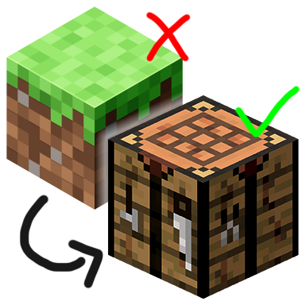

# Classic Minecraft Icon

The icon for the Minecraft game window was changed from a crafting table to a grass / dirt block during the 1.20 release.
This change affects all Minecraft versions, not just 1.20, which breaks how Minecraft should feel like

Here's a simple client-side mod to revert that change. Yes, the classic Minecraft icon is back!

This mod is client-side only and requires only the Fabric loader. It supports all Minecraft versions since 1.14
